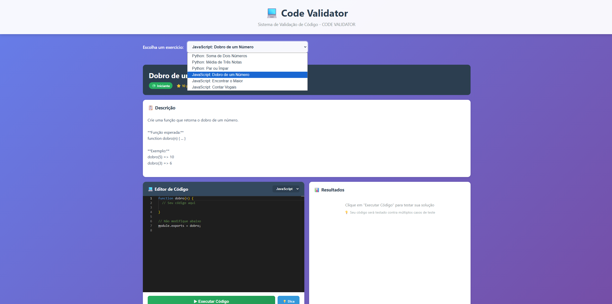
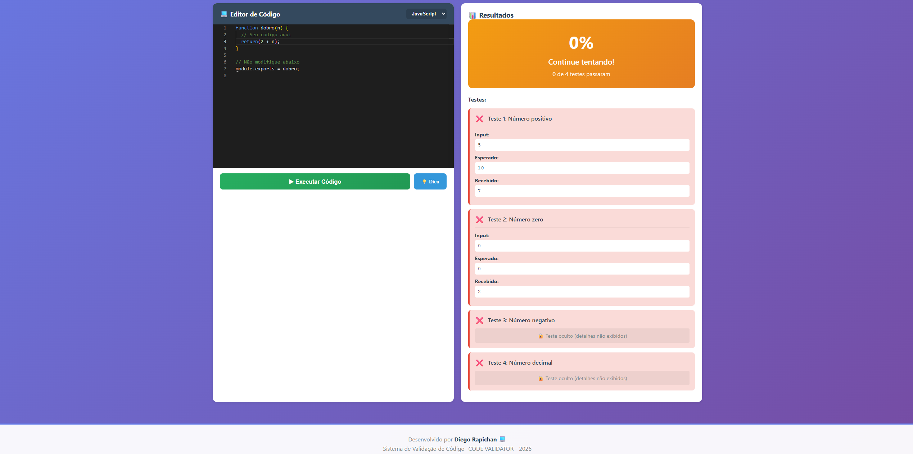

💻 Code Validator - Sistema de Validação de Código

Sistema completo de validação de código 

🎯 Sobre o Projeto
Sistema profissional de validação de código que permite:

✅ Executar código Python e JavaScript com segurança
✅ Validar automaticamente com test cases pré-definidos
✅ Testes visíveis e ocultos (evita hardcode)
✅ Feedback imediato com score e detalhes
✅ Interface moderna com editor Monaco
✅ Sistema de pontos e gamificação

Perfeito para: Plataformas de ensino, desafios de programação, bootcamps

🚀 Tecnologias
Backend:

Node.js + Express
VM2 (sandbox JavaScript)
child_process (Python isolado)
CORS, Morgan

Frontend:

React 18
Monaco Editor (editor do VS Code!)
Axios
CSS moderno

📸 Screenshots
### Interface Principal
   

### Interface Responsiva - Dispositivos Móveis
    

### Seleção de Exercícios
     

### Mensagem de Erro de Resolução
        

### Mensagem de Acerto de Resolução
           

📦 Estrutura do Projeto
code-validator/
├── backend/
│   ├── server.js                      ← Servidor Express
│   ├── package.json
│   ├── .env
│   ├── services/
│   │   └── code-execution.service.js  ← Executa e valida código
│   ├── data/
│   │   └── exercises-with-tests.js    ← Banco de exercícios
│   └── routes/
│       └── exercises.routes.js        ← API REST
│
└── frontend/
    ├── package.json
    ├── src/
    │   ├── App.jsx                    ← Aplicação principal
    │   ├── App.css
    │   └── components/
    │       ├── CodeEditor.jsx         ← Editor de código
    │       └── CodeEditor.css
    └── public/

🛠️ Instalação
1. Clone/Baixe os Arquivos
Organize assim:
seu-projeto/
├── backend/
│   ├── server.js
│   ├── package.json
│   ├── .env
│   ├── services/
│   │   └── code-execution.service.js
│   ├── data/
│   │   └── exercises-with-tests.js
│   └── routes/
│       └── exercises.routes.js
│
└── frontend/
    ├── package.json
    ├── src/
    │   ├── App.jsx
    │   ├── App.css
    │   └── components/
    │       ├── CodeEditor.jsx
    │       └── CodeEditor.css
    └── public/
        └── index.html

2. Instalar Backend
bashcd backend
npm install
Dependências instaladas:

express
cors
dotenv
vm2
morgan
nodemon (dev)

3. Instalar Frontend
bashcd frontend
npm install
Dependências instaladas:

react
react-dom
axios
@monaco-editor/react
react-scripts

4. Verificar Python
O sistema precisa do Python 3 instalado:
bashpython3 --version
Se não tiver, instale:

Windows: https://python.org/downloads
Linux: sudo apt install python3
Mac: brew install python3

🚀 Como Rodar
Terminal 1 - Backend:
bashcd backend
npm run dev
Verá:
╔════════════════════════════════════════════════╗
║     🚀  CODE VALIDATOR API                     ║
║     ✅  Servidor rodando na porta 3001         ║
║     📡  http://localhost:3001                  ║
╚════════════════════════════════════════════════╝

Terminal 2 - Frontend:
bashcd frontend
npm start
Abrirá automaticamente em: http://localhost:3000

💡 Como Usar
1. Escolha um Exercício
No dropdown, selecione:

Python: Soma de Dois Números
Python: Média de Três Notas
Python: Par ou Ímpar
JavaScript: Dobro de um Número
JavaScript: Encontrar o Maior
JavaScript: Contar Vogais

2. Escreva o Código
Use o editor Monaco (mesmo do VS Code):

Syntax highlighting
Autocomplete
Suporte Python e JavaScript

3. Execute
Clique em "▶ Executar Código"
O sistema irá:

Enviar código para o backend
Executar com cada test case
Comparar outputs
Calcular score
Mostrar resultados detalhados

4. Veja os Resultados
📊 Resultados
┌─────────────────────────┐
│   Score: 100%           │
│   🎉 Parabéns!          │
│   4 de 4 testes         │
│   +10 pontos! ⭐        │
└─────────────────────────┘

Testes:
✅ Teste 1: Números positivos pequenos
   Input: 3, 5
   Esperado: 8
   Recebido: 8

✅ Teste 2: Números positivos grandes
   Input: 1000, 2000
   Esperado: 3000
   Recebido: 3000

✅ Teste 3: Com número negativo
   🔒 Teste oculto

✅ Teste 4: Zeros
   🔒 Teste oculto

🎓 Exercícios Disponíveis
Python:

Soma de Dois Números (Iniciante - 10pts)

Ler dois números e somar

Média de Três Notas (Iniciante - 15pts)

Calcular média com 2 casas decimais

Par ou Ímpar (Iniciante - 10pts)

Verificar se número é par ou ímpar

JavaScript:

Dobro de um Número (Iniciante - 10pts)

Função que retorna dobro

Encontrar o Maior (Intermediário - 20pts)

Encontrar maior número em array

Contar Vogais (Intermediário - 20pts)

Contar vogais em string

🔧 API Endpoints
GET /api/exercises
Lista todos os exercícios
bashcurl http://localhost:3001/api/exercises

GET /api/exercises/:id
Busca exercício específico
bashcurl http://localhost:3001/api/exercises/python_001

POST /api/exercises/validate-code
Valida código do usuário
bashcurl -X POST http://localhost:3001/api/exercises/validate-code \
  -H "Content-Type: application/json" \
  -d '{
    "userId": "user123",
    "exerciseId": "python_001",
    "code": "a = int(input())\nb = int(input())\nprint(a + b)",
    "language": "python"
  }'
Resposta:
json{
  "success": true,
  "score": 100,
  "allPassed": true,
  "passedTests": 4,
  "totalTests": 4,
  "results": [...],
  "points": 10
}

🔒 Segurança
Sandbox JavaScript (VM2):

✅ Processo isolado
✅ Sem acesso a require()
✅ Sem acesso ao filesystem
✅ Timeout de 5 segundos
✅ Limite de memória

Python (child_process):

✅ Processo separado
✅ Timeout de 5 segundos
✅ Kill automático
✅ Captura de stderr

Prevenções:

❌ Loops infinitos → timeout
❌ Uso excessivo de memória → limite
❌ Acesso ao sistema → sandbox
❌ Network calls → não disponível

📚 Adicionar Novos Exercícios
Edite: backend/data/exercises-with-tests.js
javascript{
  id: 'python_004',
  title: 'Novo Exercício',
  description: 'Descrição...',
  difficulty: 'beginner', // beginner | intermediate | advanced
  course: 'PYTHON',
  starterCode: `# Código inicial`,
  testCases: [
    {
      name: 'Teste 1',
      input: '5',
      expectedOutput: '10',
      hidden: false // true = teste oculto
    }
  ],
  hints: ['Dica 1', 'Dica 2'],
  points: 10
}

🎨 Personalização
Cores do Tema:
Edite frontend/src/App.css linha 11:
cssbackground: linear-gradient(135deg, #667eea 0%, #764ba2 100%);
Timeout de Execução:
Edite backend/.env:
CODE_TIMEOUT=5000

🚀 Deploy
Backend (Heroku/Railway):
bash# Procfile
web: node server.js
Frontend (Vercel/Netlify):
bashnpm run build
# Deploy pasta build/
Importante: Atualizar API_URL no CodeEditor.jsx com URL do backend em produção

🐛 Troubleshooting
Erro: Python não encontrado
bash# Windows: Adiciona Python ao PATH
# Linux: sudo apt install python3
# Mac: brew install python3
Erro: CORS
Verifique se backend está rodando na porta 3001
Erro: VM2
bashcd backend
npm install vm2 --save

💡 Melhorias Futuras

 Suporte para mais linguagens (Java, C++, C#)
 Sistema de ranking/leaderboard
 Análise de complexidade (tempo/espaço)
 Comparação com soluções da comunidade
 Integração com GitHub
 Sistema de badges
 Editor colaborativo (múltiplos usuários)

👤 Autor
Diego Rapichan

GitHub: @DiegoRapichan

📝 Licença
MIT - Livre para usar e modificar!

Desenvolvido por Diego Rapichan

